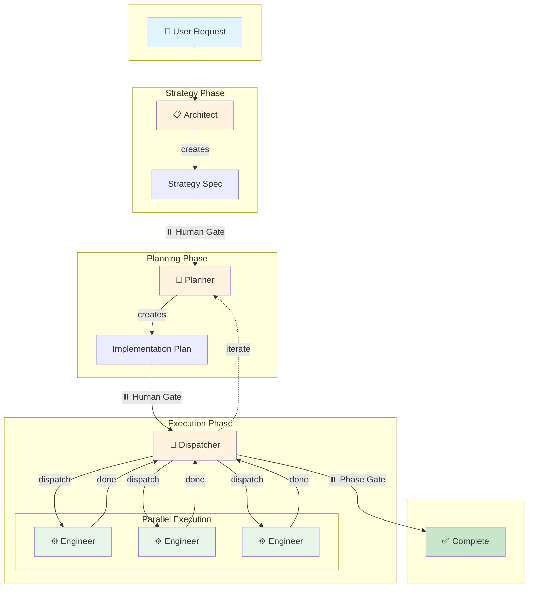

# Spec Copilot

[](https://github.com/danielmeppiel/apm)

**Spec-driven development workflow encoded as VSCode agent handoffs.**

Spec it. Ship it.

## Quick Start

```bash
apm install danielmeppiel/spec-copilot
apm compile
```

Then in VSCode Copilot Chat, select **Architect** from the agent picker dropdown.

## The Flow



### Flow Description

| Phase | Agent | Action | Output |
|-------|-------|--------|--------|
| **Strategy** | Architect | Analyzes problem, makes design decisions | Strategy document |
| ⏸️ | Human | Reviews and approves strategy | Go/No-go |
| **Planning** | Planner | Breaks down into tasks with dependencies | Implementation plan |
| ⏸️ | Human | Reviews and approves plan | Go/No-go |
| **Execution** | Dispatcher | Coordinates parallel task dispatch | Task assignments |
| **Execution** | Engineer ×N | Implements tasks with tests (parallel) | Code changes |
| ⏸️ | Human | Reviews phase completion | Next phase or iterate |

## Agents

| Agent | Role | Hands off to |
|-------|------|--------------|
| **Architect** | Strategic analysis and design decisions | Planner |
| **Planner** | Task decomposition with dependencies | Dispatcher |
| **Dispatcher** | Parallel work coordination | Engineer ×N |
| **Engineer** | Implementation with tests | Dispatcher |

## Why Use This?

- **Human gates** — You approve strategy and plan before execution
- **Parallel execution** — Multiple engineers work concurrently
- **Iteration support** — Dispatcher can loop back to Planner
- **Spec-driven** — Clear documentation at each stage
- **Shareable** — One `apm install` for your whole team
- **IDE-native** — Works via [VSCode agent handoffs](https://code.visualstudio.com/docs/copilot/customization/custom-agents#_handoffs)

## How Handoffs Work

1. Select **Architect** from agent picker → describe your problem
2. Review strategy → Click **"Create Implementation Plan"** 
3. Review plan → Click **"Dispatch Tasks"**
4. Click **"Execute Task"** for each parallel task
5. Review results → Continue or iterate

## Manual Installation

Copy `.apm/agents/*.agent.md` to your project's `.github/agents/` folder.

## License

MIT
