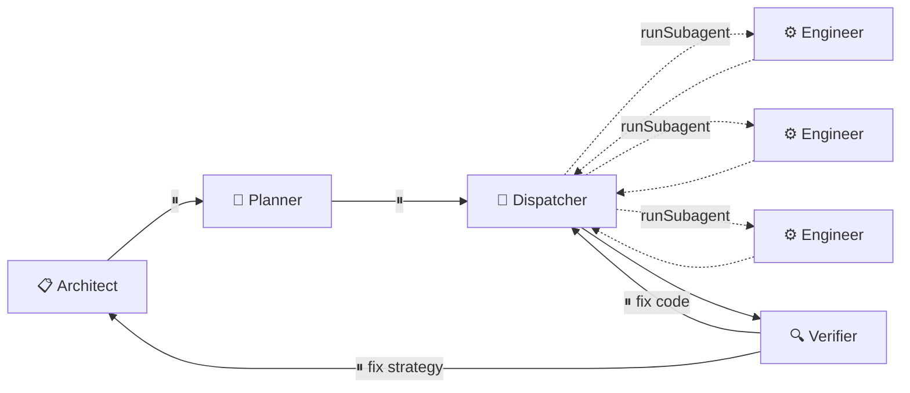

# Spec Copilot

[](https://github.com/danielmeppiel/apm)

**Spec-driven development workflow encoded as VSCode agent handoffs.**

Spec it. Ship it.

## Quick Start

```bash
apm install danielmeppiel/spec-copilot
apm compile
```

Then in VSCode Copilot Chat, select **Architect** from the agent picker dropdown.

## The Flow



> **⏸** = Human gate &nbsp;|&nbsp; **→** = Handoff &nbsp;|&nbsp; **⇢** = runSubagent

| Phase | Agent | Mechanism | Output |
|-------|-------|-----------|--------|
| Strategy | **Architect** | ⏸ Human reviews | `.spec/strategy.md` |
| Planning | **Planner** | ⏸ Human reviews | `.spec/plan.md` |
| Execution | **Dispatcher** | `runSubagent` × N | Code changes |
| Verification | **Verifier** | ⏸ Human reviews | `.spec/verification.md` |
| Correction | **Dispatcher** or **Architect** | Handoff from Verifier | Fixes |

## Artifacts

All workflow artifacts live in `.spec/` at the project root:

```
.spec/
├── strategy.md      # Strategic decisions (Architect → Planner, Verifier)
├── plan.md          # Task breakdown (Planner → Dispatcher)
└── verification.md  # Gap report (Verifier → Dispatcher, Architect)
```

Agents read/write to these exact paths — no guessing.

## Agents

| Agent | Role | Hands off to |
|-------|------|--------------|
| **Architect** | Strategic analysis, design decisions | → Planner |
| **Planner** | Task decomposition, dependencies | → Dispatcher |
| **Dispatcher** | Parallel work via `runSubagent` | → Verifier |
| **Engineer** | Implementation with tests | *(invoked by Dispatcher)* |
| **Verifier** | Strategy compliance validation | → Dispatcher or Architect |

## How It Works

1. **Architect** analyzes your problem → Produces strategy → ⏸ You approve
2. **Planner** breaks it into tasks → Creates dependency graph → ⏸ You approve
3. **Dispatcher** reads `engineer.agent.md`, invokes `runSubagent` for each task in parallel
4. Engineers complete → Dispatcher collects results → hands off to **Verifier**
5. **Verifier** checks code against strategy → ⏸ You review gaps
6. If gaps found → loops back to **Dispatcher** (fix code) or **Architect** (fix strategy)

## Why This?

- **Human gates** — Approve strategy and plan before execution
- **True parallelism** — Dispatcher uses `runSubagent` for concurrent execution
- **Closed loop** — Verifier ensures implementation matches documented strategy
- **Shareable** — One `apm install` for your whole team
- **IDE-native** — Works via [VSCode agent handoffs](https://code.visualstudio.com/docs/copilot/customization/custom-agents#_handoffs)

## Manual Installation

Copy `.apm/agents/*.agent.md` to your project's `.github/agents/` folder.

## License

MIT
